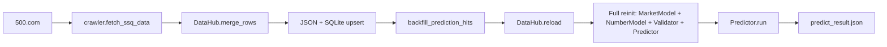
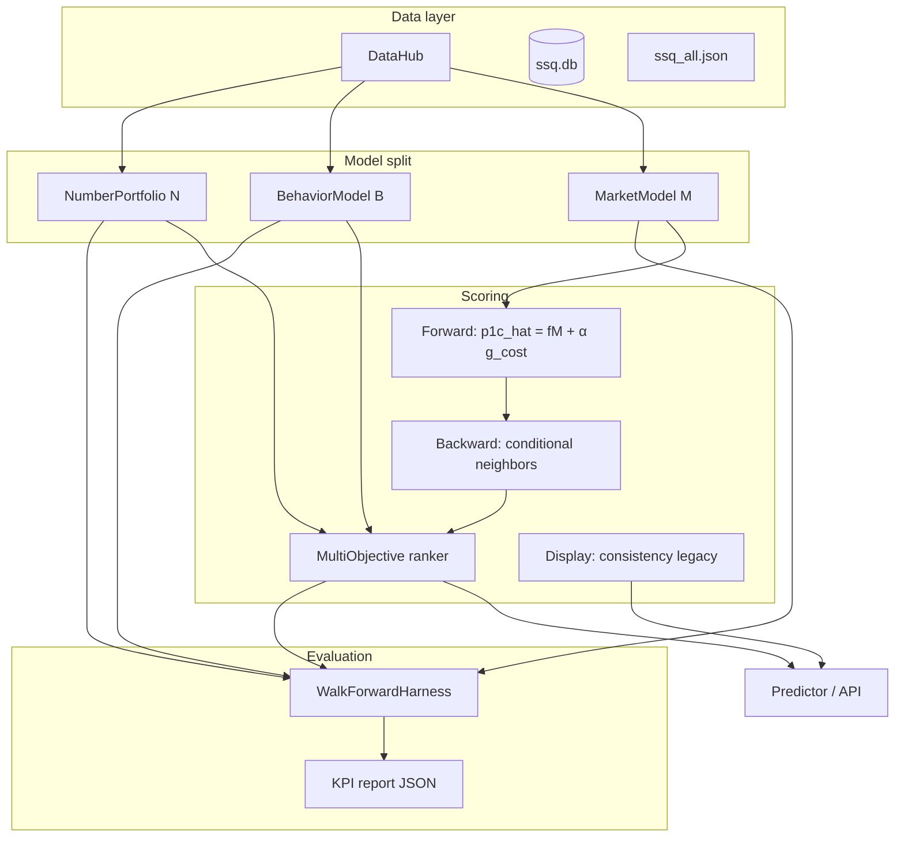
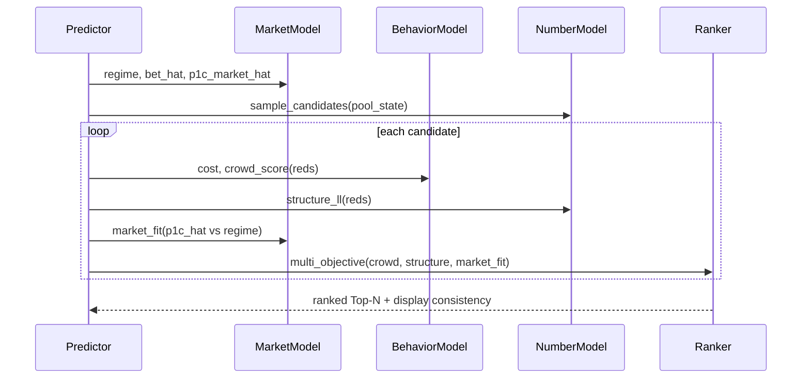
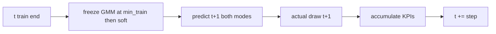
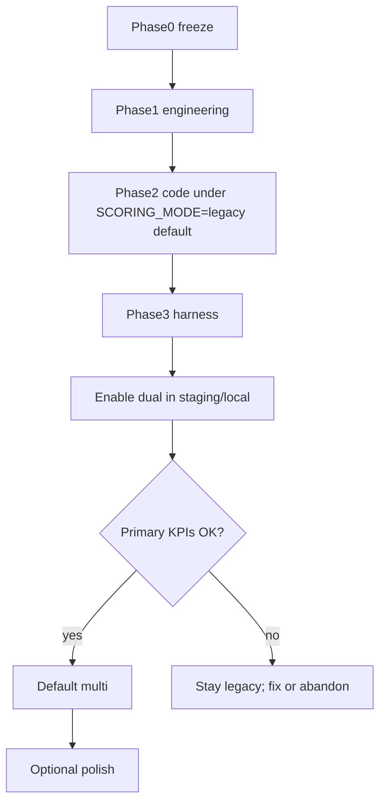
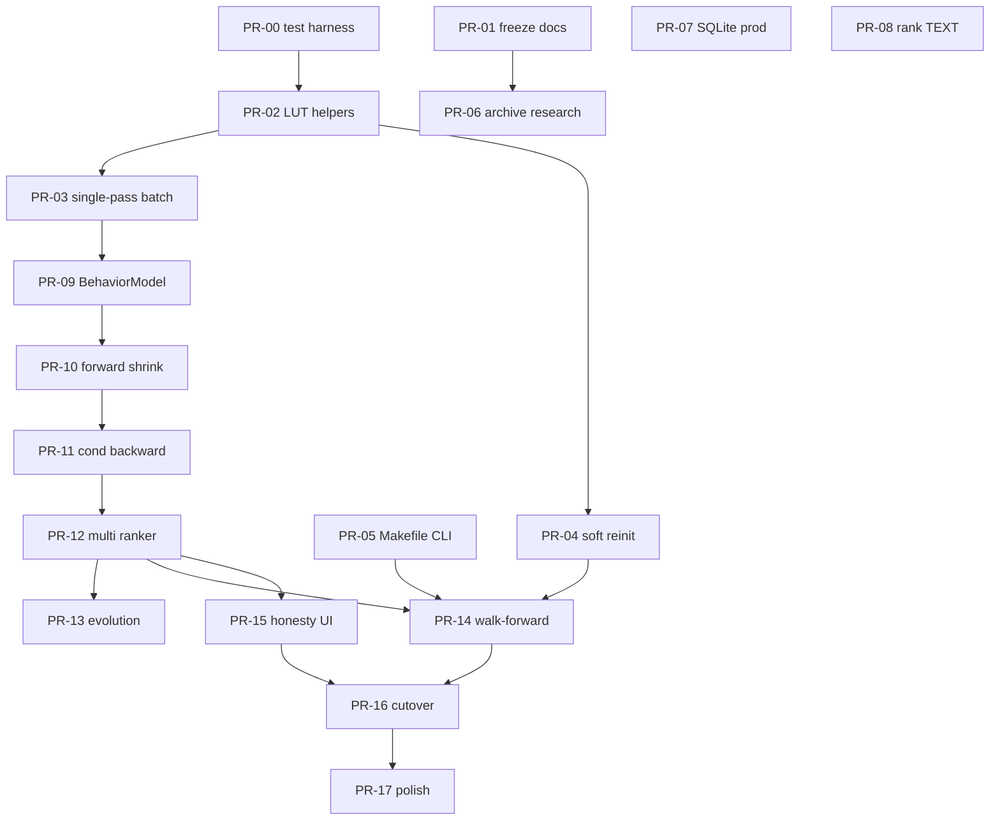

# Engineering Renovation Plan: Lottery / ssq_predictor

| Field | Value |
|-------|--------|
| **Title** | ssq_predictor Engineering Renovation Program |
| **Author** | Engineering (draft) |
| **Date** | 2026-08-08 |
| **Status** | Draft (rev 3 — re-review issues 19–21) |
| **Revision** | 2026-08-08 — rev 2 issues 1–18; rev 3 issues 19–21 |
| **Scope** | `/Users/kwangwah/Project/Lottery` product path `ssq_predictor/` + root research archive |
| **Baseline freeze** | Post crawl/DataHub/Validator issue→t fixes (see Phase 0) |

---

## Overview

`ssq_predictor` is a Flask + NumPy/scikit-learn Web product that loads ~3.5k 双色球 draws, models market regimes, samples candidate tickets, scores them with a forward/backward “consistency” loop, and optionally runs genetic evolution. Recent engineering work already landed a real crawler, incremental merge, draw-day scheduling, and several correctness/perf fixes. Two remaining problems dominate:

1. **Engineering debt** — double backward in batch validation, full model reinit on every data update, no unified CLI/Makefile, research scripts polluting the product tree, SQLite thread safety, schema type bugs (`predictions.rank`), production readiness gaps.
2. **Algorithmic misalignment** — scientific work shows red/blue draws are essentially unpredictable; market feedback is real; yet ranking and evolution optimize **self-consistency of cost→prize→regime**, not hit probability or calibrated market forecasts. Product copy and fitness functions still imply predictive power they do not have.

This document is the single implementable program that freezes the current baseline, finishes engineering hygiene, re-splits the stack into Market (M) / Behavior (B) / Number-Portfolio (N) models with honest multi-objective ranking, adds a walk-forward evaluation harness with fixed KPIs, and ships feature-flagged dual scoring so old and new paths run side-by-side until metrics decide the cutover.

---

## Background & Motivation

### Current architecture (as implemented)

```
app.py (Flask + APScheduler)
  ├── engine/data_hub.py     DataHub: JSON + SQLite, features, merge_rows / update_from_remote
  ├── engine/crawler.py      fetch_ssq_data from 500.com
  ├── engine/market.py       MarketModel: GMM regime, feedback LR, KMeans Markov
  ├── engine/numbers.py      NumberModel + CompoundBetPlanner
  ├── engine/validator.py    Validator: forward / backward / consistency / batch_validate / backtest
  ├── engine/predictor.py    Predictor.run orchestration
  ├── engine/evolution.py    PatternGene + Evolution (fitness = avg consistency via LUT)
  └── scripts/crawl_update.py CLI update entry
```

Data flow on draw day (`app.run_update` / `scripts/crawl_update.py`):



### What is already done (baseline — do not re-propose as greenfield)

| Area | Implementation |
|------|----------------|
| Crawler + merge | `engine/crawler.py`, `DataHub.update_from_remote` / `merge_rows` / `_upsert_draw_sqlite` |
| CLI modes | `scripts/crawl_update.py --data-only` / `--predict-only` |
| Schedule | `config.DRAW_WEEKDAYS` Tue/Thu/Sun, `UPDATE_HOUR=22`, `STARTUP_FETCH=auto`, `STALE_DAYS=2` |
| Backward index correctness | `Validator.backward` uses `DataHub.issue_to_t`, not `draws.id - 1` |
| Red features | Vectorized `_build_red_features` in `data_hub.py` |
| Cost recent freq | `NumberModel._build_freq_tables` / `recent_freq_vector` O(1) prefix sums |
| Regime inference | `MarketModel.get_regime` uses train mean/std + labels for in-sample `t` |

### Pain points (remaining)

**Engineering**

1. **`batch_validate` double work** — for each candidate, `consistency_score` calls `forward` + `backward`, then `batch_validate` calls `forward` and `backward` again (`Validator.batch_validate` — double call). Evolution already uses a prize LUT (`Evolution._build_lut`); batch path does not.
2. **Hard reinit** — `app.reinit_engine` and CLI always reconstruct GMM (5-comp, `n_init=10`) + KMeans (12, `n_init=20`) + full cost regression even when only one new draw arrived.
3. **No Makefile / unified CLI** — ops are split across `app.py`, `scripts/crawl_update.py`, `init_data.py`, `init_db.py`.
4. **Research pollution** — root `ssq_*.py` and `*_result.txt` duplicate engine logic and confuse the product path.
5. **Production gaps** — `sqlite3.connect(..., check_same_thread=False)` without a write lock; bare `except:` in evolution progress I/O; Flask dev server noted as non-production in `docs/engineering_notes.md`.
6. **`predictions.rank` type mix** — schema says `rank INT` (`scripts/init_db.py`, `data_hub._auto_migrate`) but `api_save_predictions` inserts compound ranks `'A'..'D'` (TEXT).

**Algorithm**

| Finding | Implication | Local artifact (pre-archive path) |
|---------|-------------|-----------------------------------|
| Chi-square / AC / conditional R²≈0 for numbers | Do not optimize “pick numbers to hit” without evidence | Root `zone_predictor_result.txt`; `docs/engineering_notes.md` §条件回归 R² |
| pool→bet r≈0.678; bet→prize r≈0.574; cost→prize1 r≈0.037 | Market is the strong signal; cost is weak shrinkage only | `config.FEEDBACK_*`; `docs/engineering_notes.md` §反馈回路; `house_model_result.txt` (cost r) |
| Consistency score | Self-consistency of cost→prize→regime, **not** P(hit) | `engine/validator.py` `consistency_score` |
| Evolution fitness = avg consistency | Circular: genes optimized to agree with the same weak loop | `engine/evolution.py` `Evolution.evaluate` |
| Sampling | Profile reject-sampling; blue = `random.randint(1,16)`; docs claim weighted sampling not fully matched | `engine/numbers.py` `_sample_from_dist` / `sample_candidates` |
| Evaluation | `Validator.backtest` is weak (200 cands, top-1 red hits only); no p1c MAE / crowd percentile / walk-forward protocol | `engine/validator.py` `backtest` |

### Why now

Baseline data plumbing is stable enough to (a) ship low-risk perf/devex without model risk, then (b) re-architect scoring behind flags with a harness that can **reject** algorithm changes that only improve vanity metrics.

---

## Goals & Non-Goals

### Goals

1. Freeze and document the post-crawl baseline (Phase 0).
2. Cut batch_validate cost roughly **~2×** via single-pass + prize LUT; soft-reinit incremental draws.
3. Unified `make` / CLI for `update | predict | check | serve | eval`.
4. Archive research scripts out of the product mental model.
5. Harden SQLite concurrency notes, exception handling, gunicorn + scheduler guidance.
6. Fix `predictions.rank` schema/API contract.
7. Split runtime into **M / B / N** models with multi-objective ranking; demote consistency to display.
8. Forward: `p1c_hat = f(M) + α·g(cost)` with α≪1 shrinkage.
9. Backward: neighbors on `(p1c, pool, bet, regime)` not prize alone.
10. Walk-forward harness with fixed primary KPIs; dual-run old vs new scoring.
11. Honest UI/docs: self-consistency ≠ win probability.

### Non-Goals

- Claiming or optimizing for guaranteed lottery profit.
- Replacing 500.com as primary source (out of scope unless crawler breaks).
- Full rewrite away from Flask/NumPy in this program.
- Online learning / live bet slip data (no real crowd tickets).
- Real-time multi-user auth / payments.
- Migrating research notebooks into production inference without KPI proof.

---

## Proposed Design

### High-level target architecture



### Phased program

```mermaid
gantt
  title Renovation phases (person-days approximate)
  dateFormat  X
  axisFormat  %s
  section Phase0
  Baseline freeze + docs          :0, 1
  section Phase1
  batch_validate LUT + soft reinit :1, 4
  Makefile CLI + archive research  :4, 7
  SQLite rank + prod notes         :7, 9
  section Phase2
  M/B/N split + forward shrink     :9, 14
  Multi-obj rank + feature flags   :14, 18
  Evolution re-scope               :18, 20
  section Phase3
  Walk-forward harness + KPIs      :20, 25
  Product honesty UI/docs          :25, 27
  section Phase4
  Optional polish                  :27, 30
```



---

## Phase 0 — Baseline Freeze

### Goals

Lock “current product truth” so later PRs can regress against known behavior.

### Deliverables

1. Tag or commit marker: `baseline/post-crawl-v1` (or documented SHA in `docs/baseline_freeze.md`).
2. Freeze note in `docs/engineering_notes.md` + `docs/baseline_freeze.md` listing Thread 1 “already done” items.
3. **Golden fixture script** `scripts/freeze_golden.py` (or one-shot notebook equivalent):
   - Sets `random.seed(SEED)` and `np.random.seed(SEED)` **before** `Predictor.run` (sklearn GMM/KMeans already use `random_state=42`; Python `random` in `sample_candidates` does **not** — seeding is mandatory).
   - Writes `tests/fixtures/golden_predict_meta.json` with `{seed, n_candidates, latest_issue, N, git_sha, scoring_mode}`.
   - Snapshots top-10 reds/scores under legacy mode (optional full `predict_result.json` under `tests/fixtures/`).
4. **Research archive inventory** (explicit file list in freeze note — no move yet). Minimum set verified at project root:

**Scripts (`ssq_*.py`):**  
`ssq_attention_model.py`, `ssq_attention_v2.py`, `ssq_bettor_behavior.py`, `ssq_bidirectional.py`, `ssq_cumulant_analysis.py`, `ssq_cumulant_evo.py`, `ssq_dynamics.py`, `ssq_evolution.py`, `ssq_evolution_v2.py`, `ssq_house_model.py`, `ssq_number_analysis.py`, `ssq_prob_kernel.py`, `ssq_zone_predictor.py`

**Result / analysis artifacts (`*result*.txt` and related):**  
`bettor_behavior_result.txt`, `bidirectional_result.txt`, `cumulant_evo_result.txt`, `cumulant_result.txt`, `dynamics_result.txt`, `evolution_result.txt`, `evolution_v2_result.txt`, `house_model_result.txt`, `kernel_result.txt`, `number_analysis.txt`, `result.txt`, `result_full.txt`, `triad_check.txt`, `zone_predictor_result.txt`

**Analysis markdowns (optional archive):** `Lottery_Analysis.md`, `Strategy_From_House.md`, `EDUCATION_OUTLINE.md`  
**Do not move:** `F0ckssq-mcp/`, `ssq_predictor/`, or large crawler data dumps under `F0ckssq-mcp/data/` (stay put; product uses `ssq_predictor/data/`).

5. **Scientific coefficient re-verify map** (cite before archive moves):

| Claim | Where to re-verify |
|-------|-------------------|
| cost→prize1 r≈0.037 | `house_model_result.txt`; `docs/engineering_notes.md` §成本模型 |
| pool→bet r≈0.678, bet→prize r≈0.574, prize→pool r≈−0.341 | `config.FEEDBACK_*`; `docs/engineering_notes.md` §反馈回路; `bettor_behavior_result.txt` |
| feature conditional R²≈0 | `zone_predictor_result.txt`; `docs/engineering_notes.md` §条件回归 R² |
| birthday 1.16 | `config.BIRTHDAY_EFFECT`; engineering_notes §生日号效应 |

### Acceptance criteria

- [ ] Document lists freeze SHA / date and latest issue id + `N`.
- [ ] Golden meta JSON exists with seeds; re-run with same seed reproduces top-10 reds under legacy.
- [ ] Research inventory list checked into freeze note (paths above).
- [ ] `python3 scripts/crawl_update.py --predict-only` completes without error on frozen data.
- [ ] No algorithm interface changes in this phase.

### Effort

**0.5–1 person-day**

### Risks

| Risk | Severity | Mitigation |
|------|----------|------------|
| Golden fixture drifts with nondeterministic sampling | Med | Freeze script **must** set `random.seed` + `np.random.seed` before `Predictor.run`; store seeds in fixture metadata. GMM/KMeans already fixed at `random_state=42`. |

---

## Phase 1 — Performance & Developer Experience

### Goals

Ship engineering items from Thread 1 without changing ranking semantics.

### 1.1 Single-pass `batch_validate` + prize LUT

**Problem:** `Validator.batch_validate` (`engine/validator.py` → symbol `Validator.batch_validate`; as of freeze: double call ~L142–147): for each candidate, `consistency_score` runs forward+backward, then `batch_validate` runs forward+backward **again**. Evolution already caches neighbors via `Evolution._build_lut` (as of freeze ~L120–125) with `top_k=30`.

**Parity scope (locked):** Phase 1.1 preserves **`batch_validate` ranking and score vectors only**. It does **not** require bit-identity with `Evolution.evaluate` (which historically used `top_k=30` without `tbd_bonus`). Optional later PR may share LUTs.

**Config unification:**

```python
# config.py
BACKWARD_LUT_MAX_PRIZE = 200          # was EVOLVE_LUT_MAX_PRIZE
BACKWARD_TOP_K = 20                   # batch_validate default; matches Validator.backward default
# Evolution may keep top_k=30 via EVOLVE_BACKWARD_TOP_K until a later unify PR
PRIZE_CLAMP = lambda x: int(round(max(0, min(BACKWARD_LUT_MAX_PRIZE, x))))
# Must match evolution path: int(round(max(0, min(200, est_prize))))
```

**Design:**

```python
def ensure_backward_lut(self, max_prize=None, top_k=None):
    max_prize = max_prize if max_prize is not None else BACKWARD_LUT_MAX_PRIZE
    top_k = top_k if top_k is not None else BACKWARD_TOP_K
    # Invalidate if top_k/max_prize differ from cache meta
    if getattr(self, "_backward_lut", None) is not None \
       and self._backward_lut_meta == (max_prize, top_k):
        return
    self._backward_lut = {p: self.backward(p, top_k=top_k) for p in range(max_prize + 1)}
    self._backward_lut_meta = (max_prize, top_k)

def invalidate_backward_lut(self):
    self._backward_lut = None
    self._backward_lut_meta = None

def _score_from_backward(self, back_result, current_regime) -> float:
    """Pure regime_prob*0.7 + concentration*0.3 — same math as consistency_score mid-body.
    Does NOT include tbd_bonus (that remains batch_validate-only)."""
    ...

def consistency_score(...):
    # Public API unchanged: forward → backward → _score_from_backward only (no tbd).
    ...

def batch_validate(self, candidates):
    self.ensure_backward_lut(top_k=BACKWARD_TOP_K)  # 20, not 30
    ...
    for reds, blue, cost in candidates:
        est_prize = self.forward(reds, bet_amount)
        key = PRIZE_CLAMP(est_prize)  # same clamp as evolution
        back_result = self._backward_lut.get(key)
        raw = self._score_from_backward(back_result, current_regime)
        tbd_bonus = self._tbd_bonus(back_result, tbd_prior)  # batch-only, max +0.2 overlap term
        adjusted = min(1.0, raw * (1.0 + tbd_bonus))
        results.append({..., 'consistency': adjusted, 'raw_consistency': raw, ...})
```

**Extraction rule:** `_score_from_backward` is shared; **`consistency_score` must not gain `tbd_bonus`** (today only `batch_validate` applies it). Evolution continues its own LUT until explicitly migrated.

**File touch points:** `engine/validator.py`, `config.py`; tests under `tests/` (see PR-00). Evolution optional share deferred.

**Acceptance**

- Golden: same fixed candidate list → top-10 reds and `consistency` values match pre-change within **1e-9** (identical rounded prize keys + same `top_k=20`).
- Wall time for `batch_validate(2000)` drops ~1.5–2.5×.
- Unit: `lut[k] == backward(k, top_k=BACKWARD_TOP_K)` for sample k.
- `consistency_score` public numeric API unchanged (no tbd).

**Effort:** 1–1.5 pd  
**Risks:** LUT stale after data update — must call `invalidate_backward_lut` from soft/full reinit (see §1.2).

---

### 1.2 Soft vs full engine reinit

**Problem:** `app.reinit_engine` always does `DataHub().reload()` then constructs new `MarketModel` / `NumberModel` / `Validator` / `Predictor` (symbol `reinit_engine`; as of freeze ~L59–67). That re-runs GMM (`n_init=10`) + KMeans (`n_init=20`) + full cost walk. `DataHub` is a **singleton** (`DataHub.__new__`); feature rebuild (`_build_red_features`, market, profiles) on `reload()` often dominates wall time for +1 draw **even more than** GMM.

#### Soft-update checklist (v1 — implement all of these)

| Step | Component | Soft behavior | Full behavior |
|------|-----------|---------------|---------------|
| 1 | `DataHub` | v1 **accepts full feature rebuild** via `reload()` / `merge_rows(rebuild=True)` (correctness-first). Optional later: incremental tensor extend (“fast path”) out of Phase 1 scope unless free. | same reload |
| 2 | `MarketModel` regime | Freeze `_regime_model`, `_regime_mean`, `_regime_std`. **Predict** labels for new rows only; concatenate. History labels `0..N_old-1` immutable. | `full_refit` → `_build_regime_model` |
| 3 | `MarketModel` Markov | **Must store** at fit time: `_markov_mean`, `_markov_std` (same pattern as regime — today `_build_markov` standardizes with live `X.mean/std` and does **not** persist transforms). Soft: `markov_km.predict` on frozen transform for new rows only. | refit KMeans + transforms |
| 4 | Transition matrices | Recompute `regime_T` / `regime_T_bwd` / `markov_T*` from extended labels — O(N), cheap. | same |
| 5 | Feedback LR (`_build_feedback`) | Soft: **skip refit** (coefficients stable at +1 draw). Full: refit. | refit |
| 6 | `NumberModel` freq | Soft: extend `_hit_csum` / `_latest_recent` for new rows (or rebuild csum — O(N·33) acceptable). | rebuild |
| 7 | `NumberModel` cost series | Soft: append `_all_costs` / `_all_p1c` for new `t`; **skip** `LinearRegression.fit` on soft. Full: refit `_cost_to_prize`. | refit |
| 8 | `Validator` LUT | **Always** `invalidate_backward_lut()` after any data change; rebuild on next `batch_validate`. Also clear `Evolution.backward_lut` if instance lives. | same |
| 9 | Globals | `reinit_engine` rebinds `dh, mm, nm, v, p` (or mutates in place then rebinds `v`/`p` if models mutated). Soft may mutate `mm`/`nm` in place + new `Validator(dh,mm,nm)`. | new instances |
| 10 | Engine state file | Read/write `data/engine_state.json` **metadata only** (timestamps/issue/alpha — **not** GMM/KMeans weights) | update on full |

#### Process model (locked — Phase 1)

**Soft reinit is in-process only.** It mutates long-lived `mm`/`nm` instances that already hold fitted GMM/KMeans in RAM (Flask globals after `init_engine()`, or the same objects on the APScheduler thread via `app.run_update`).

| Entry point | Soft allowed? | Behavior |
|-------------|---------------|----------|
| `app.reinit_engine` / `app.run_update` / draw-day scheduler | **Yes** (when policy says soft) | Mutate existing `mm`/`nm`; skip `.fit` |
| `scripts/cli.py update` / `scripts/crawl_update.py` (cold process) | **No** | Always `mode=full` — construct `MarketModel(dh)` + `NumberModel(dh)` once on post-merge data |
| Fresh process with only `engine_state.json` | **No soft** | State file is **bookkeeping only** (see below) |

**Why not soft on CLI:** A cold CLI has no prior GMM/KMeans. Naive "full-fit on N then merge then soft on N+1" is **slower** than one full fit on N+1. Phase 1 does **not** serialize sklearn models.

**`data/engine_state.json` does NOT persist models.** Contents are metadata only:

```json
{
  "last_full_refit_at": "2026-08-08T22:05:00",
  "last_full_refit_issue": "26084",
  "last_mode": "full|soft",
  "n_at_refit": 3481,
  "forward_cost_alpha": 0.07,
  "alpha_train_range": [2000, 3480]
}
```

No GMM/KMeans/joblib blobs. Soft cannot be reconstructed from this file alone. (Optional Phase 4: persist to `data/models/` — **out of Phase 1 scope**.)

```python
# app.py — long-lived process only
def reinit_engine(mode="auto", rows_changed=0, *, allow_soft=True):
    global dh, mm, nm, v, p
    state = load_engine_state()  # metadata only; not model weights
    force_full = (
        mode == "full"
        or not allow_soft                    # CLI / cold start always full
        or os.environ.get("FULL_REFIT") == "1"
        or rows_changed > SOFT_REINIT_MAX_ROWS
        or days_since(state.get("last_full_refit_at")) >= FULL_REFIT_EVERY_DAYS
        or state.get("n_at_refit") is None
        or mm is None or nm is None
    )
    dh = DataHub().reload()  # v1: full feature rebuild OK
    if force_full:
        mm = MarketModel(dh)          # full GMM+KMeans+feedback
        nm = NumberModel(dh)
        save_engine_state(full=True, issue=dh.latest_issue)
    else:
        mm.soft_update(dh)            # requires in-memory fitted models
        nm.soft_update(dh)
        save_engine_state(full=False)
    v = Validator(dh, mm, nm)
    v.invalidate_backward_lut()
    p = Predictor(dh, mm, nm, v)

# scripts/cli.py update / crawl_update — always full
def cli_reinit_after_merge(dh, rows_changed=0):
    mm = MarketModel(dh)   # always full fit; ignore soft policy
    nm = NumberModel(dh)
    save_engine_state(full=True, issue=dh.latest_issue)
    v = Validator(dh, mm, nm)
    p = Predictor(dh, mm, nm, v)
    return mm, nm, v, p
```

**Policy (in-process only)**

| Trigger | Mode |
|---------|------|
| In-process **and** `rows_changed` <= `SOFT_REINIT_MAX_ROWS` **and** last full refit < `FULL_REFIT_EVERY_DAYS` | soft |
| CLI / cold start / no live `mm`/`nm` | **full always** |
| Large backfill / first boot / missing state / n_clusters change | full |
| `days_since(last_full_refit_at) >= FULL_REFIT_EVERY_DAYS` | full |
| Manual `FULL_REFIT=1` or `reinit_engine(mode="full")` | full |

**Wire-up:** `app.run_update` passes `rows_changed` with `allow_soft=True`. CLI **never** calls soft path (hard-code full or `allow_soft=False`). Scheduler uses the same in-process soft policy as `run_update`.

**Acceptance (split)**

| ID | Criterion |
|----|-----------|
| A | In-process soft after +1 draw: `GaussianMixture.fit` / `KMeans.fit` **not** called (mock/spy). |
| B | `mm._regime_labels[:N_old]` identical after soft update. |
| C | LUT invalidated after soft/full. |
| D | `engine_state.json` records full vs soft; after 7 days (mocked), next **in-process** update forces full. |
| E | Full refit works after large merge. |
| F | **CLI path always invokes full fit** (test asserts GMM.fit called; never `soft_update`). |
| G | Doc/test assert `engine_state.json` has **no** model weights (schema keys only). |
| H | *(Optional Phase 4)* joblib model persist for CLI soft — **not** required for PR-04. |

**Effort:** 2–2.5 pd  
**Risks (Med):** Soft only helps long-running `app` draw-day path (the main win). CLI remains one full fit — acceptable. Label drift mitigated by `FULL_REFIT_EVERY_DAYS` on in-process path.

---

### 1.3 Makefile + unified CLI

**Packaging constraint:** `ssq_predictor/scripts/` today has **no** `__init__.py` and is not an installable package. Entrypoints use `sys.path.insert(0, project_root)` (see `scripts/crawl_update.py`). Therefore **`python3 -m scripts.cli` will fail** unless packaging is added.

**Chosen design (preferred):** extend `scripts/crawl_update.py` into argparse **subcommands** (or add sibling `scripts/cli.py` with the same `sys.path.insert` pattern as `crawl_update.py`). Do **not** rely on `-m scripts` without packaging.

```makefile
# ssq_predictor/Makefile — run from ssq_predictor/ CWD
.PHONY: update predict check serve eval test init-db
update:
	python3 scripts/cli.py update
predict:
	python3 scripts/cli.py predict
check:
	python3 scripts/cli.py check
serve:
	python3 app.py
eval:
	python3 scripts/cli.py eval --window 200
test:
	python3 -m pytest tests/ -q
```

**CWD requirement (README):** all `make` targets assume current working directory is `ssq_predictor/` (where `config.py` and `engine/` live).

| Command | Implementation |
|---------|----------------|
| `update` | same as today’s crawl_update full path + soft/full reinit |
| `predict` | `--predict-only` |
| `check` | wrap `scripts/init_data.py` + optional schema checks |
| `serve` | `app.py` |
| `eval` | Phase 3 harness; Phase 1 stub prints “not implemented” exit 0 |
| `test` | pytest (PR-00) |

**Acceptance:** From `ssq_predictor/`, `make update|predict|check|serve|test` work; README documents CWD. No `python -m scripts` unless `__init__.py` + `PYTHONPATH=.` added in same PR.

**Effort:** 1 pd

---

### 1.4 Archive root research scripts

**Move** (git mv) from `Lottery/` root → `Lottery/research/archive/` using the **Phase 0 inventory list** (complete script + result file names). Do not invent a partial glob that misses `result.txt` / `result_full.txt` / `number_analysis.txt` / `triad_check.txt`.

**Archive README** (`research/archive/README.md`) must include a path map for coefficients cited in `docs/engineering_notes.md`:

| Coefficient / analysis | Old path | New path |
|------------------------|----------|----------|
| Feedback loops / regimes | `ssq_bettor_behavior.py`, `bettor_behavior_result.txt` | `research/archive/...` |
| Cost model r=0.037 | `ssq_house_model.py`, `house_model_result.txt` | `research/archive/...` |
| Conditional R²≈0 | `ssq_zone_predictor.py`, `zone_predictor_result.txt` | `research/archive/...` |
| Bidirectional / evolution | `ssq_bidirectional.py`, `ssq_evolution_v2.py`, … | `research/archive/...` |

**Do not move:** `ssq_predictor/`, `F0ckssq-mcp/` (and its `data/` dumps), product docs.

**Acceptance:** Full inventory from Phase 0 relocated or explicitly listed as “kept at root with reason”; archive README path map complete; `python3 app.py` from product dir still works.

**Effort:** 0.5–1 pd  
**Risks (Low):** Broken personal scripts — archive README path map.

---

### 1.5 SQLite thread safety, bare except, production notes

**SQLite concurrency (locked design)**

- Retain `check_same_thread=False` for single-process Flask + APScheduler + request threads.
- Introduce `DataHub._db_lock = threading.RLock()`.
- **`db_query` / `db_query_one` / direct `self.db.execute` paths all take the lock** (reads **and** writes). Rationale: `Validator.backward` issues SQL while draw-day upserts/`backfill_prediction_hits` may run on the scheduler thread; write-only locking still races readers mid-UPDATE.
- Prefer short critical sections: after Phase 2 multi mode, prefer **in-memory** neighbor arrays for ranking so `backward` holds the lock only if still on SQL prize path.
- Enable WAL optionally: `PRAGMA journal_mode=WAL` on connect (document; single-writer still assumed).
- Document: **official support = single process**. gunicorn **`-w 1`** if in-process APScheduler; for `-w >1` disable scheduler in workers and use system cron → `make update`.

**Bare except**

- Replace bare `except:` in `engine/evolution.py` (`_write_progress`, `_clear_progress`, `load_weights`) with `except OSError` / `except (OSError, json.JSONDecodeError, TypeError, KeyError)`.
- `backfill_prediction_hits`: log failures at debug, increment `failed` counter in return dict.

**Production notes** (`docs/engineering_notes.md`)

```
gunicorn -w 1 -b 0.0.0.0:8080 'app:app'   # w=1 if using in-process scheduler
# OR: w>1 + disable APScheduler in workers + system cron → make update
```

**Effort:** 1 pd

---

### 1.6 `predictions.rank` type fix

**Problem:** Schema `rank INT` (`scripts/init_db.py` / `data_hub._auto_migrate`) vs compound inserts `'A'..'D'` in `app.api_save_predictions`. SQLite affinity may coerce or store inconsistently; comparison `ORDER BY p.rank` is wrong for TEXT/mixed.

**Design (chosen):** display `rank` always **TEXT**; sort via `rank_order INTEGER`.

| entry_type | rank (TEXT) | rank_order |
|------------|-------------|------------|
| single | `"1"`..`"12"` | 1..12 |
| compound | `"A"`..`"D"` | 101..104 |

#### Migration script steps (`scripts/migrate_predictions_rank_v2.py` + `_auto_migrate`)

SQLite cannot `ALTER COLUMN` type. Order is mandatory:

1. **Add nullable column** (safe on existing DB):  
   `ALTER TABLE predictions ADD COLUMN rank_order INTEGER;`  
   (Do **not** add `NOT NULL` yet.)
2. **Backfill `rank_order`** from existing `rank` (handle mixed affinities):

```sql
UPDATE predictions SET rank_order = CAST(rank AS INTEGER)
  WHERE typeof(rank) IN ('integer','real') OR rank GLOB '[0-9]*';
UPDATE predictions SET rank_order = 100 + (unicode(rank) - unicode('A') + 1)
  WHERE rank IN ('A','B','C','D') OR lower(rank) IN ('a','b','c','d');
-- fallback unknowns
UPDATE predictions SET rank_order = 999 WHERE rank_order IS NULL;
```

3. **Rebuild table** with final schema:

```sql
CREATE TABLE predictions_new (
  id INTEGER PRIMARY KEY AUTOINCREMENT,
  batch_id INT NOT NULL REFERENCES predict_batch(batch_id),
  saved_at TEXT NOT NULL DEFAULT (datetime('now')),
  target_issue TEXT NOT NULL,
  entry_type TEXT NOT NULL DEFAULT 'single',
  rank TEXT NOT NULL,
  rank_order INTEGER NOT NULL,
  reds TEXT NOT NULL,
  blue /* keep existing meaning */,
  ... -- remaining columns identical
);
INSERT INTO predictions_new (...)
  SELECT id, batch_id, saved_at, target_issue, entry_type,
         CAST(rank AS TEXT), rank_order, reds, blue, ...
  FROM predictions;
DROP TABLE predictions;
ALTER TABLE predictions_new RENAME TO predictions;
CREATE INDEX IF NOT EXISTS idx_pred_batch ON predictions(batch_id);
CREATE INDEX IF NOT EXISTS idx_pred_target ON predictions(target_issue);
CREATE INDEX IF NOT EXISTS idx_pred_rank_order ON predictions(target_issue, rank_order);
```

4. Only after rebuild is `rank_order NOT NULL` enforced (column created NOT NULL on new table).
5. **Same PR** updates `api_save_predictions` to write TEXT rank + rank_order, and `api_comparison` to `ORDER BY p.target_issue DESC, p.rank_order ASC` (not `p.rank`).
6. Downtime: local single-user; migration runs at startup via `_auto_migrate` or explicit `make` target — document one-time cost.

**Acceptance**

- Insert batch with singles 1..10 + compounds A–D succeeds.
- `GET /api/predict/comparison` returns order 1..12 then A..D by `rank_order`.
- Idempotent re-run of migrate does not corrupt rows.

**Effort:** 1 pd

---

### Phase 1 summary

| Item | Effort (pd) | Acceptance highlight |
|------|-------------|----------------------|
| batch_validate LUT | 1–1.5 | ~2× faster, score parity @ 1e-9 |
| soft reinit (app-only) + engine_state meta | 2–2.5 | in-process soft; CLI always full; LUT invalidate |
| Makefile/CLI (script path) | 1 | `python3 scripts/cli.py` from product CWD |
| archive research + path map | 0.5–1 | full inventory relocated |
| SQLite all-access lock + prod | 1 | RLock on all db_query |
| rank TEXT + rebuild migrate | 1 | comparison ORDER BY rank_order |
| test harness (PR-00, shared) | 1–1.5 | pytest + mini fixtures |
| **Phase 1 total** | **~8–10 pd** | |

**Phase 1 risks overall:** Low algorithmic risk; primary risk is soft-reinit label drift (weekly full refit).

---

## Phase 2 — Algorithm Split (M / B / N)

### Goals

Implement scientific conclusions as code structure, not blog posts. Old consistency scoring remains available behind flags.

### 2.1 Three-model split

| Model | Responsibility | Primary home | Inputs | Outputs |
|-------|----------------|--------------|--------|---------|
| **M Market** | Regime, feedback, Markov, bet/pool forecasts, baseline p1c from market | `engine/market.py` (extend) | pool, bet, p1c history | regime, `bet_hat`, `p1c_market_hat`, T_fwd/T_bwd |
| **B Behavior / Crowd** | Anti-crowding, birthday effect, hot/cold as **crowd proxy**, cost as popularity | `engine/behavior.py` **new** (extract from numbers) | reds, recent freq, bday | `crowd_score`, `cost`, popularity lists |
| **N Number / Portfolio** | Structure likelihood under unconditional (and weak conditional) profile; sampling; compound coverage | `engine/numbers.py` (trim) | profiles, feat_mean/std | `structure_ll`, candidates, compounds |



**Migration:** Behavior methods move out of `NumberModel` without breaking imports. `NumberModel._raw_cost_score` remains the **single source of house cost / crowd**; Behavior reuses it (no second parallel formula).

---

### 2.1b Score formulas (v1 locked — implementable)

All multi scores are computed per candidate, then **batch min-max** normalized to [0,1].

**Edge cases**

- If `max == min` for a component → all values become `0.5` (neutral; avoid div-by-zero).
- Ties on `final`: higher `structure`, then lower `crowd_raw`, then lexicographic `tuple(reds)`.
- Compound planner coverage weights use **`final`** in multi mode; **`consistency`** in legacy mode.

#### A. `crowd_raw` / `anti_crowd` (BehaviorModel)

Reuse house cost — do **not** invent separate birthday/hot weights:

```python
def crowd_raw(self, reds, t=None) -> float:
    return self.nm._raw_cost_score(reds, t=t)  # same as numbers.py house cost

def anti_crowd_raw(self, reds, t=None) -> float:
    return -self.crowd_raw(reds, t=t)
# anti_crowd = minmax(anti_crowd_raw over batch) ∈ [0,1]
```

#### B. `structure` (NumberModel)

Diagonal Gaussian LL on profile features (not ball IDs):

```python
STRUCT_FEATURES = ['span','sum','odd','z1','z2','z3','bday','cons','prime','same_tail']
# mu/sd = NumberModel.feat_mean / feat_std (unconditional; WF: fit on 0..t only)

def structure_ll_raw(reds) -> float:
    prof = profile_from_reds(reds)  # same fields as DataHub._build_profiles
    ll = 0.0
    for i, name in enumerate(STRUCT_FEATURES):
        mu, sd = feat_mean[i], max(feat_std[i], 1e-6)
        z = clip((prof[name] - mu) / sd, -6, 6)
        ll += -0.5 * z * z   # drop log(sd) constant across candidates
    return ll
# structure = minmax(structure_ll_raw)
```

Reject-sampled candidates are already profile-constrained → structure variance is compressed but still ranks relatively. No second structure reject at score time.

#### C. `market_fit` (v1 — single definition)

**Primary:** regime agreement from neighbors of `p1c_hat` (continuity with legacy `regime_prob`):

```python
def market_fit_raw(p1c_hat, current_regime, pool, bet) -> float:
    back = backward_conditional(...) if BACKWARD_MODE == "conditional" else backward(p1c_hat)
    if not back:
        return 0.0
    return float(back["regime_dist"].get(current_regime, 0.0))  # ∈ [0,1]
```

**Not used for v1 ranking:** inverse |p1c_hat − regime_mean| (diagnostic only).

#### D. `final` + display consistency

```python
final = (0.40 * anti_crowd + 0.40 * structure + 0.20 * market_fit)  # RANK_WEIGHTS
# consistency = legacy batch adjusted score — DISPLAY ONLY; weight 0 in final
```

**Acceptance:** fixed seed + fixed candidates → identical score vectors within **1e-9**.

---

### 2.2 Forward path: shrinkage (units locked)

Naive `cost - mean_cost` is **not** in p1c units. `estimate_prize1` uses log10 cost→p1c then bet scaling. v1 locks units:

1. **\(f_M\)** primary = bet→p1c via existing `_reg_bet_prize` only:

```python
def predict_p1c_from_market(self, bet: float) -> float:
    log_p = self._reg_bet_prize.predict([[np.log10(bet + 1)]])[0]
    return float(10 ** log_p - 1)
```

Regime conditional mean of p1c = diagnostic only in v1.

2. **\(g\)** in **p1c space**:

```python
def cost_to_p1c_base(self, reds, t=None) -> float:
    cost = self._raw_cost_score(reds, t=t)
    log_p = self._cost_to_prize.predict([[cost]])[0]
    return float(10 ** log_p - 1)  # no bet scaling

def g_cost_p1c(self, reds, t=None) -> float:
    return self.cost_to_p1c_base(reds, t=t) - self._train_mean_cost_to_p1c
```

3. **Combine:** \(\hat p_{1c} = \max(0, f_M(\mathrm{bet}) + \alpha \cdot g_{\mathrm{p1c}})\).

4. **α calibration sample (locked — do not calibrate on one candidate batch):**

   For a **single** prediction batch, `bet` is fixed so `f_M` is **constant** across candidates, and
   `Var(α·g) / Var(f_M + α·g)` is **identically 1** for any α ≠ 0. That ratio is **not** a valid
   calibration objective on one batch.

   **Population = temporal train series** (one sample per period t):

```python
# scripts/calibrate_forward_alpha.py
train_lo, train_hi = 0, N - 1  # record range in metadata
samples_f, samples_g = [], []
for t in range(train_lo, train_hi + 1):
    # f_M varies with bet_t over time
    f_t = mm.predict_p1c_from_market(dh.bet[t])
    # g from **actual** reds at t (p1c-space residual)
    reds_t = actual_reds(dh, t)
    g_t = nm.g_cost_p1c(reds_t, t=t)  # train mean of cost_to_p1c on same window
    samples_f.append(f_t)
    samples_g.append(g_t)
# grid α ≥ 0:
#   hat_t = f_t + α * g_t
#   pick α with Var(α*g) / Var(hat) ∈ [0.05, 0.10]
#   if none, pick α minimizing |share - 0.075|
```

   Persist `{forward_cost_alpha, alpha_train_range, alpha_var_share}` in `data/engine_state.json`
   and/or config override. Placeholder `FORWARD_COST_ALPHA=0.05` is pre-calibration only.

   **Implication for ranking:** When scoring one issue, `f_M` is still constant across candidates,
   so α·g **does not reorder** tickets by cost alone — it shifts absolute `p1c_hat` for neighbor /
   `market_fit` lookup. Multi ranking still relies on anti_crowd / structure / market_fit.

```python
def forward_p1c(self, reds, bet_amount=None, t=None) -> dict:
    bet = bet_amount or self.dh.bet[self.dh.latest_t]
    p1c_m = self.mm.predict_p1c_from_market(bet)
    g = self.nm.g_cost_p1c(reds, t=t)
    p1c_hat = max(0.0, p1c_m + self.alpha * g)
    return {"p1c_hat": p1c_hat, "p1c_market": p1c_m, "g_p1c": g, "alpha": self.alpha}
```

Legacy `forward()` unchanged when `SCORING_MODE=legacy`.

```python
SCORING_MODE = os.environ.get("SSQ_SCORING_MODE", "legacy")
# multi/dual also require SSQ_ALLOW_EXPERIMENTAL_SCORING=1 until PR-16 (see Rollout)
FORWARD_COST_ALPHA = float(os.environ.get("SSQ_FORWARD_COST_ALPHA", "0.05"))
RANK_WEIGHTS = {"anti_crowd": 0.40, "structure": 0.40, "market_fit": 0.20}
```

---

### 2.3 Backward: conditional neighbors

**Legacy:** SQL `ORDER BY ABS(prize1_cnt - ?)`.

**New (in-memory preferred for N≈3.5k):**

\[
d_i = w_p |z(p1c_i)-z(\hat p)| + w_{pool}|z(pool_{i-1})-z(pool_{now})| + w_{bet}|z(bet_{i-1})-z(bet_{now})| + w_r \cdot 1\{\mathrm{regime}_{i-1} \ne r_{now}\}
\]

Default `BACKWARD_DIST_WEIGHTS`: `w_p=1.0`, `w_pool=0.5`, `w_bet=0.5`, `w_r=0.25`. z-scores from history through t.

```python
def backward_conditional(self, p1c_hat, pool, bet, regime, top_k=None) -> dict:
    top_k = top_k or BACKWARD_TOP_K
    # argpartition on d_i; return same shape as backward()
```

**Acceptance:** `w_pool=w_bet=w_r=0`, `w_p=1` → neighbor sets ≈ legacy prize-only (ties aside).

---

### 2.4 Multi-objective ranking + report / frontend contract

**Sort:** `final` desc (multi); `consistency` desc (legacy).

| Field | Presence | Meaning |
|-------|----------|---------|
| `predictions` | always | **Active** UI list (mode sort) |
| `predictions_legacy` | `dual` only | Legacy order for comparison; UI optional |
| `scoring_mode` | always | `legacy` \| `multi` \| `dual` |
| `predictions[].scores` | multi/dual | anti_crowd, structure, market_fit, final, consistency |
| `predictions[].consistency` | always | back-compat |

**Ranks 11–12:** keep frontend frequency synthesis as **non-scored** 「频次参考」; do not invent high `final`.

**Frontend checklist (PR-12/15):** bind primary UI to `predictions` only; dual optional collapsible legacy; consistency secondary + tooltip; multi chips 抗拥挤/结构/市场拟合; 11–12 labeled; disclaimer banner.

---

### 2.5 Sampling honesty

- `_sample_from_dist` = reject sampling on profile targets (document).
- Optional weighted red / empirical blue (`SAMPLE_BLUE_MODE`).
- Blue uniform default until eval shows value.

---

### 2.6 Evolution re-scope

**Default timeline (single source of truth):**

| When | `EVOLUTION_MODE` | UI 「全量」 |
|------|------------------|-----------|
| PR-01 … PR-12 | `legacy_consistency` | Works; add honest label ASAP |
| PR-13 | `legacy_consistency` (behavior-preserving) | Label required: 「研究用自洽进化（非命中优化）」 |
| After PR-15 | flip default → `off` | Hidden or disabled with env re-enable hint |
| Later optional | `market_hyper` / `compound` | Fitness must use Phase 3 KPIs |

Do **not** document config default as `off` while product still ships evolve button without the honesty pass.

**File touch points:** `engine/evolution.py`, `engine/predictor.py`, `web/templates/index.html`, `config.py`.

---

### Phase 2 summary

| Deliverable | Effort (pd) |
|-------------|-------------|
| BehaviorModel extract + shims | 1.5 |
| Forward shrinkage + market p1c | 1.5 |
| Conditional backward | 1.5 |
| Multi-obj ranker + flags + report schema | 2 |
| Evolution re-scope + UI labels | 1 |
| Sampling docs + optional empirical blue | 0.5 |
| **Phase 2 total** | **~8–10 pd** |

**Risks**

| Risk | Severity | Mitigation |
|------|----------|------------|
| Multi scores degrade UX “pretty” consistency clustering | Med | dual mode + side-by-side UI badge |
| α miscalibrated | Med | calibrate on train residual variance; flag |
| In-memory neighbor O(N·C) cost | Low | N=3.5k, C=2k → fine with vectorization |

---

## Phase 3 — Evaluation & Product Honesty

### Goals

Define what “better” means; wire harness; change product language.

### 3.1 KPI definitions

#### Primary KPIs (algorithm got better)

| KPI | Definition | Better direction | Random baseline |
|-----|------------|------------------|-----------------|
| **p1c MAE** | mean \|p1c_hat − actual p1c\| on walk-forward | ↓ | predict train mean p1c |
| **p1c sMAPE** | symmetric MAPE | ↓ | same |
| **bet forecast error** | MAE/MAPE of `predict_bet(pool_{t})` vs `bet_{t+1}` or lag-consistent target | ↓ | predict mean bet |
| **hit-vs-random (red)** | avg red hits of top-1 / top-k tickets vs Hypergeometric expectation \(6 \times 6/33\) | ↑ only if >1.0 with CI | E[hits]=1.091 |
| **hit@compound** | for compound plans, max red hits / coverage | informational | random compound same size |
| **crowd percentile of actual draw** | percentile of actual reds’ crowd_score among null samples; if actual systematically high crowd, anti-crowd strategy has edge for **prize sharing**, not hit rate | context | U[0,1] null |

#### Secondary / diagnostic

| KPI | Role |
|-----|------|
| Regime accuracy (1-step) | M quality |
| Markov top-1 next-state accuracy | M quality |
| cost–p1c correlation (rolling) | monitor weak channel |
| Neighbor stability (Jaccard of top_k issues) | backward robustness |

#### Vanity metrics (must not be sole ship gate)

| Metric | Why vanity |
|--------|------------|
| Mean consistency of top-10 | Circular with evolution fitness |
| Evolution best fitness | Same loop |
| “Passed” rate (score>0.2) | Threshold arbitrary |
| Coverage rate of compound planner | Optimizes self-defined weights |

**Ship rule (operational cutover gate):** multi becomes default only after a recorded go decision. Consistency-only improvement is **never** sufficient.

#### Cutover checklist (required artifact before PR-16)

Produce `data/eval/cutover_decision.md` (and machine-readable `data/eval/cutover_decision.json`) from the dual WF report (`data/eval/latest.json`).

**KPI priority order**

1. **Market KPIs must not regress beyond ε** (hard gate).
2. **Hit-vs-random must not be significantly worse than legacy or random** (hard gate).
3. Messaging / disclaimer complete (hard gate for product).
4. Structure/anti-crowd UX subjective quality (soft).

| Gate | Metric | Threshold (v1) | Role |
|------|--------|----------------|------|
| G1 | p1c MAE (multi) vs p1c MAE (legacy) | multi ≤ legacy × **1.05** | **Scoring cutover** (hard) |
| G2 | p1c MAE (multi) vs mean-baseline | preferred ≤ mean×1.00; **must** ≤ mean×**1.10** | **Scoring cutover** (hard) |
| G3 | bet forecast MAE (shared M) | See below — **not** multi-vs-legacy | **Market health** (hard, mode-independent) |
| G4 | hit-vs-random top-1 red | 95% bootstrap CI (B=1000) for multi must **overlap or exceed** random E[hits]≈1.0909 **or** overlap legacy CI. Fail if multi upper CI < random **and** multi mean < legacy mean − 0.05 | **Scoring cutover** (hard); top-k diagnostic only |
| G5 | Honesty | disclaimer in API + UI + docs | **Product** (hard) |
| — | mean consistency | **ignored** | vanity |

**G3 redefined (not multi-vs-legacy):** Legacy and multi share `MarketModel.predict_bet`, so multi-vs-legacy bet MAE is **always identical** and cannot gate scoring. G3 is instead a **market-model health** gate on every WF report:

- Metric: MAE of `predict_bet(pool_t)` vs actual `bet_{t+1}` (or lag-consistent target documented in WF metadata) over the same WF steps.
- Baseline file: `data/eval/baseline_market.json` produced at Phase 0 freeze / first full WF under protocol `wf_freeze_soft_v1`, fields e.g. `{bet_mae, p1c_market_mae, protocol, git_sha, n_steps, created_at}`.
- Threshold: current WF `bet_mae` ≤ `baseline_market.bet_mae` × **1.05** (≤ +5% regression vs freeze baseline).
- Failure of G3 → **NO-GO or defer cutover** until M is diagnosed (data bug, soft-label drift, etc.); it does **not** mean "pick legacy ranking over multi." Re-running dual with the same M will not fix G3.

**Conflict policy:** If multi **improves** p1c MAE but **worsens** hit slightly within G4 tolerance → **still GO** (p1c is primary scoring gate). If G1 fails → **NO-GO** even if consistency soars. If G4 fails hard → **NO-GO** or keep multi experimental. If G3 fails → fix market path / refresh baseline only with documented reason; do not "pass" cutover by ignoring M health.

**Process:** Owner records reviewer name/date, paths to `wf_*.json`, gate table pass/fail, and decision `go|no-go|defer` in `cutover_decision.md`. PR-16 description must link that file.

---

### 3.2 Walk-forward harness

**New module:** `engine/eval/walk_forward.py` + `python3 scripts/cli.py eval`

#### Locked primary protocol name: `wf_freeze_soft_v1`

*(Promoted from former Open Question #1 — Key Decision 15.)*

| Parameter | Value |
|-----------|--------|
| `protocol` | `wf_freeze_soft_v1` |
| `min_train` | 2000 |
| `step` | 1 (full run); smoke may use step=5 |
| At t=`min_train` | **Full fit** GMM/KMeans/feedback/cost on data `0..t` |
| For t > min_train | **Soft-predict** new labels only (production soft reinit fidelity); extend cost series; **refit cost→p1c LR and feedback LR every step on 0..t** (cheap) OR every `lr_refit_every=10` steps (document choice in metadata; default every step for correctness) |
| Sensitivity appendix | `wf_full_refit_K50`: full GMM/KMeans every K=50 steps — **not** cutover-gating |
| `n_candidates` | 500 full / 100 CI smoke |
| `top_k` | 10 |
| `modes` | `("legacy","multi")` |
| `seed` | 42 (and record in JSON) |

Every `data/eval/wf_*.json` **must** embed metadata:

```json
{"protocol": "wf_freeze_soft_v1", "seed": 42, "min_train": 2000, "K_sensitivity": 50,
 "n_candidates": 500, "git_sha": "...", "alpha": 0.07, "scoring_modes": ["legacy","multi"]}
```

```python
@dataclass
class WFConfig:
    protocol: str = "wf_freeze_soft_v1"
    min_train: int = 2000
    step: int = 1
    n_candidates: int = 500
    top_k: int = 10
    modes: tuple = ("legacy", "multi")
    seed: int = 42
```

**Outputs:** `data/eval/wf_{timestamp}.json`, copy to `data/eval/latest.json`.

**CI smoke:** `make eval WINDOW=20 CANDIDATES=50` with **stubs** allowed for GMM (pre-fit once) — hard time budget **120s**. Full WF is manual/nightly.



**Leakage rules**

- Features for t+1 use data through t only (`latest_t=t` simulation).
- Never score historical t with cost LR fit on full N (production bug to avoid in eval).
- Record protocol name so dual comparisons are never mixed across protocols.

---

### 3.3 Product honesty

**Docs / UI copy changes**

| Location | Change |
|----------|--------|
| `docs/algorithm.md` | Lead with unpredictability of numbers; market section primary; consistency demoted |
| `docs/user_manual.md` | “自洽度 ≠ 中奖概率”; show KPI disclaimer |
| `docs/engineering_notes.md` | Link this renovation plan; vanity vs primary KPIs |
| `web/templates/index.html` | Labels: 市场拟合 / 结构合理 / 抗拥挤; consistency as secondary chip |
| `README.md` | Honest method summary |

**API:** add `disclaimer` field to report JSON.

---

### Phase 3 summary

| Deliverable | Effort (pd) |
|-------------|-------------|
| KPI module + cutover checklist thresholds | 1 |
| Walk-forward harness `wf_freeze_soft_v1` + CLI | 3 |
| Sensitivity appendix `wf_full_refit_K50` | 0.5 |
| UI/docs honesty pass | 1 |
| Dual report + cutover_decision artifact | 0.5 |
| **Phase 3 total** | **~6–7 pd** |

**Risks:** Eval too slow if full GMM every step — primary protocol freezes GMM; CI uses WINDOW=20 + stubs.

---

## Phase 4 — Optional Polish

| Item | Effort | Notes |
|------|--------|-------|
| True weighted red sampling | 1–2 pd | Only if structure KPI needs it |
| Empirical blue sampling | 0.5 pd | Low risk |
| gthread/gunicorn recipe + Docker | 1 pd | w=1 or external cron |
| Progress websocket instead of file poll | 1 pd | nice-to-have |
| Features cache `features.npz` | 1 pd | config already has `FEATURES_FILE` unused |
| Compound planner objective switch to multi scores | 1 pd | depends Phase 2 |

**Phase 4 total:** ~4–6 pd optional.

---

## API / Interface Changes

### Config (`config.py`)

```python
# Phase 1
SOFT_REINIT_MAX_ROWS = 5
BACKWARD_LUT_MAX_PRIZE = 200
BACKWARD_TOP_K = 20
FULL_REFIT_EVERY_DAYS = 7
ENGINE_STATE_FILE = "data/engine_state.json"  # metadata only: timestamps/issue/alpha — NOT model weights

# Phase 2
SCORING_MODE = "legacy"  # legacy | multi | dual — default always legacy until PR-16
# multi/dual require env SSQ_ALLOW_EXPERIMENTAL_SCORING=1 until cutover (PR-16 removes gate)
FORWARD_COST_ALPHA = 0.05  # placeholder; replace after calibrate_forward_alpha
RANK_WEIGHTS = {"anti_crowd": 0.40, "structure": 0.40, "market_fit": 0.20}
EVOLUTION_MODE = "legacy_consistency"  # → "off" after PR-15; also market_hyper | compound
SAMPLE_BLUE_MODE = "uniform"  # uniform | empirical
BACKWARD_MODE = "prize_only"  # prize_only | conditional
BACKWARD_DIST_WEIGHTS = {"p1c": 1.0, "pool": 0.5, "bet": 0.5, "regime": 0.25}
```

### Validator

| Method | Change |
|--------|--------|
| `forward` | legacy; wrap `forward_p1c` when multi |
| `forward_p1c` | **new** |
| `backward` | unchanged prize neighbors |
| `backward_conditional` | **new** |
| `batch_validate` | single-pass + LUT; mode-aware rank key |
| `consistency_score` | kept for display / legacy |
| `score_candidate` | **new** multi-objective |

### Predictor report

- Add `scoring_mode`, `disclaimer`, per-prediction `scores` object.
- Keep `consistency` field for backward-compatible frontend.

### HTTP

| Endpoint | Change |
|----------|--------|
| `GET /api/predict` | includes new fields |
| `GET /api/status` | `scoring_mode`, `engine_soft_reinit` |
| `GET /api/eval/summary` | **new** optional, serves last WF report |
| `POST /api/predict/save` | rank as TEXT + rank_order |

### Before / after ranking

```
BEFORE: sort by adjusted consistency
AFTER (multi): predictions sorted by final; consistency attached for display
AFTER (dual): predictions = multi order; predictions_legacy = legacy order
UI always consumes predictions; never requires predictions_legacy
```

**Experimental gate:** `Predictor.run` / API reject `SCORING_MODE in {multi,dual}` unless `SSQ_ALLOW_EXPERIMENTAL_SCORING=1` **or** cutover completed (`config.SCORING_EXPERIMENTAL_GATE = False` after PR-16).

---

## Data Model Changes

### `predictions` table

| Column | Old | New |
|--------|-----|-----|
| `rank` | INT (broken for A–D) | TEXT |
| `rank_order` | — | INTEGER NOT NULL |
| `score_final` | — | REAL NULL (Phase 2) |
| `score_anti_crowd` | — | REAL NULL |
| `score_structure` | — | REAL NULL |
| `score_market_fit` | — | REAL NULL |
| `scoring_mode` | — | TEXT NULL |

Migration strategy: follow §1.6 ordered steps in `scripts/migrate_predictions_rank_v2.py` + `_auto_migrate` (nullable rank_order → backfill → table rebuild → indexes). Never add `rank_order NOT NULL` before backfill.

### Eval artifacts

```
data/eval/
  wf_YYYYMMDD_HHMMSS.json
  latest.json
  cutover_decision.md
  cutover_decision.json
  baseline_market.json   # G3 M-health freeze baseline
data/engine_state.json   # soft/full reinit bookkeeping
```

### No change required

`draws` schema remains stable; crawler row format unchanged.

---

## Alternatives Considered

### A1. Keep monolithic Validator; only tune weights of consistency

- **Pros:** Small diff.
- **Cons:** Still optimizes self-consistency; does not address scientific findings; evolution remains circular.
- **Decision:** Reject as primary path; keep as `legacy` mode only.

### A2. Full ML ticket classifier (GBDT on red features → hit)

- **Pros:** Fashionable; easy to overfit demos.
- **Cons:** Contradicts R²≈0 / chi-square results; high risk of false confidence; hard to explain.
- **Decision:** Out of scope unless walk-forward proves lift; not Phase 2 default.

### A3. Drop number recommendations entirely; market dashboard only

- **Pros:** Most honest product.
- **Cons:** Product currently is a recommender; users expect tickets.
- **Decision:** Keep portfolio construction as **structure + anti-crowd entertainment/portfolio**, not “prediction of winning numbers”; messaging Phase 3.

### A4. SQLite multi-column neighbor query vs in-memory

- **Pros:** SQL purity.
- **Cons:** Awkward ABS multi-key; N small.
- **Decision:** In-memory conditional neighbors for multi mode.

### A5. Always full refit models

- **Pros:** Simple.
- **Cons:** Slow draw-day path; unnecessary variance from re-clustering.
- **Decision:** Soft reinit default + periodic full refit.

---

## Security & Privacy Considerations

| Topic | Notes |
|-------|-------|
| Threat model | Local/personal tool; no auth today. Risk = SSRF only if URL configurable (not); path traversal low. |
| Data | Public lottery draws; no PII. |
| Write APIs | `POST /api/predict/save` unauthenticated — acceptable for LAN; document bind to localhost for shared hosts. |
| Crawl | Outbound HTTPS to 500.com only; validate parsed rows (`crawler._validate_row`). |
| Injection | Parameterized SQL already used in upserts; keep discipline on any new dynamic SQL. |
| Secrets | None required. |

---

## Observability

| Signal | Implementation |
|--------|----------------|
| Structured update log | `run_update` already prints; add JSON line to `data/logs/update.jsonl` (optional Phase 1) |
| Timings | `report.elapsed`; add `timings.batch_validate_ms`, `timings.soft_reinit_ms` |
| Eval KPIs | `data/eval/latest.json` |
| Health | `/api/status` — scoring_mode, should_fetch, latest_issue |
| Alerting | Out of scope for single-user; cron failure = nonzero exit on `make update` |

---

## Rollout Plan



**Feature flags**

| Flag | Default | Cutover |
|------|---------|---------|
| `SCORING_MODE` | `legacy` | dual (local+`SSQ_ALLOW_EXPERIMENTAL_SCORING=1`) → multi after G1–G5 + `cutover_decision` |
| `SSQ_ALLOW_EXPERIMENTAL_SCORING` | unset/0 | Required for multi/dual until PR-16; README warns: do not enable in production before PR-14 report |
| `BACKWARD_MODE` | `prize_only` | → `conditional` with multi |
| `EVOLUTION_MODE` | `legacy_consistency` | → `off` after PR-15 honesty pass |
| Soft reinit | on | keep; full every `FULL_REFIT_EVERY_DAYS` via `engine_state.json` |

**Rollback**

- Set `SSQ_SCORING_MODE=legacy` (and/or clear experimental env); no DB downgrade for scoring.
- Rank migration: read TEXT ranks; `rank_order` backfilled.

**README warning (PR-12):** “Do not set `SCORING_MODE=multi` in production until `data/eval/cutover_decision.md` says go. Use experimental env only for local dual runs.”

---

## Testing Strategy

### Greenfield harness (no `tests/` today)

Repo currently has **no** `tests/` directory, pytest config, or CI. Budget **+1–1.5 pd** in **PR-00** (before or folded into PR-02):

| Deliverable | Detail |
|-------------|--------|
| `tests/` package | `conftest.py` with path bootstrap (`sys.path` → `ssq_predictor/`) |
| `pytest` | add to `requirements.txt` |
| `tests/fixtures/mini_draws.json` | ~50 sliced real or synthetic draws |
| `make test` | `python3 -m pytest tests/ -q` |
| Optional CI | GitHub Action or local-only note in README |

### Unit (after harness)

| Test | Target |
|------|--------|
| `test_batch_validate_lut_parity` | LUT vs live backward |
| `test_batch_validate_single_pass_parity` | top-10 scores within 1e-9 vs pre-change golden |
| `test_soft_reinit_no_fit` | mock GMM.fit / KMeans.fit not called |
| `test_soft_reinit_history_labels_stable` | labels[0:N0] unchanged |
| `test_soft_reinit_lut_invalidated` | LUT None after soft |
| `test_rank_text_migration` | A–D save/load; comparison order |
| `test_forward_shrinkage_alpha0` | equals market-only p1c |
| `test_g_cost_in_p1c_units` | g mean ~0 on train |
| `test_backward_conditional_prize_only` | ≈ legacy neighbors |
| `test_score_formulas_deterministic` | fixed candidates → fixed vectors |
| `test_kpi_random_baseline` | E[hits]=6*6/33 |
| `test_engine_state_full_refit_days` | mocked clock forces full |

### Golden fixtures

- Mini draws + `golden_predict_meta.json` (seed, sha, top-10 legacy).

### Walk-forward smoke

- `make eval WINDOW=20 CANDIDATES=50` **≤ 120s** (allow model stubs in CI).
- Assert schema + protocol metadata + no NaNs.
- Full dual WF = manual/nightly, not default CI.

### Manual QA

- +1 draw → soft reinit → predict; after 7d state → full refit.
- UI disclaimer; comparison sort after rank migration.
- Frontend checklist §2.4.

---

## Open Questions

1. ~~Expanding GMM refit cadence~~ → **Resolved:** Key Decision 15 / protocol `wf_freeze_soft_v1`; sensitivity `wf_full_refit_K50`.
2. **Default RANK_WEIGHTS calibration** — v1 ships 0.40/0.40/0.20; optional train diagnostic pass may retune before PR-16 (record in cutover_decision).
3. **Compound save of multi scores** — **Resolved default:** store all components (`score_*` columns) when present; final alone insufficient for dual analysis.
4. **Multi-worker deployment** — **Resolved:** officially **w=1** with in-process scheduler; w>1 only with external cron and scheduler disabled (documented, not primary).
5. ~~Ranks 11–12~~ → **Resolved:** keep as non-scored 「频次参考」 (§2.4).
6. **LR refit every step vs every 10 in WF** — default every step; if too slow, every 10 with metadata flag (minor).

---

## References

- `ssq_predictor/docs/algorithm.md` — current inference description
- `ssq_predictor/docs/engineering_notes.md` — architecture + limitations + coefficient writeups
- `ssq_predictor/docs/data_structure.md` — schemas
- Research origins (to be archived; re-verify claims here):  
  `ssq_bettor_behavior.py` + `bettor_behavior_result.txt`,  
  `ssq_house_model.py` + `house_model_result.txt` (cost r≈0.037),  
  `ssq_zone_predictor.py` + `zone_predictor_result.txt` (R²≈0),  
  `ssq_bidirectional.py`, `ssq_evolution_v2.py`
- Key product modules: `engine/{data_hub,crawler,market,numbers,validator,predictor,evolution}.py`, `app.py`, `config.py`

---

## Key Decisions

1. **Baseline first, algorithm second**  
   *Rationale:* Crawl/merge/schedule already shipped; unblocking perf/devex reduces cost of every later experiment.

2. **Single-pass batch_validate + shared prize LUT**  
   *Rationale:* Evolution already proved LUT equivalence (`Evolution._build_lut`); removing double backward is pure win.

3. **Soft reinit by default; periodic full refit**  
   *Rationale:* One new draw should not re-run GMM/KMeans; historical labels must stay stable for validator lookups.

4. **Three-model split M / B / N**  
   *Rationale:* Matches scientific decomposition (market strong, behavior for crowding, numbers as structure/portfolio not oracle).

5. **Forward = f_M(bet) via `_reg_bet_prize` + alpha*g in p1c units; alpha calibrated on temporal train series**  
   *Rationale:* cost→p1c r≈0.037 is weak; residual must be p1c-scaled; Var(alpha*g)/Var(f+alpha*g) in [0.05,0.10] over periods t (not one candidate batch where f_M is constant).

6. **Conditional multi-key backward; prize-only remains legacy**  
   *Rationale:* Prize alone ignores pool/bet/regime already in DataHub.

7. **Multi-objective ranking with locked formulas; consistency display-only**  
   *Rationale:* crowd = −house cost; structure = diagonal Gaussian on profiles; market_fit = neighbor regime mass; sort by final.

8. **Evolution default `legacy_consistency` until honesty pass, then `off`**  
   *Rationale:* Preserve button behavior during Phase 2; stop advertising consistency evolution as product after PR-15.

9. **Numeric cutover gates G1–G5 + `cutover_decision` artifact; G3 = M-health vs `baseline_market.json`**  
   *Rationale:* Qualitative “no regression” is not operational. G1/G2/G4 gate multi vs legacy scoring; G3 cannot compare modes (shared `predict_bet`) and instead bounds bet MAE vs freeze baseline.

10. **Feature flags default legacy + experimental env gate until PR-16**  
    *Rationale:* Prevent early multi in production; dual only with `SSQ_ALLOW_EXPERIMENTAL_SCORING=1`.

11. **`predictions.rank` TEXT + ordered rebuild migration for `rank_order`**  
    *Rationale:* Fixes A–D; SQLite cannot ALTER type in place.

12. **Research scripts archived with full inventory + coefficient path map**  
    *Rationale:* Provenance for r=0.037, R²≈0, feedback r, birthday 1.16.

13. **SQLite: RLock on all db_query; official gunicorn w=1**  
    *Rationale:* Reads race writes on draw day; multi-worker not primary support.

14. **Honest product language is a deliverable**  
    *Rationale:* engineering_notes principle; UI must match.

15. **Walk-forward primary protocol `wf_freeze_soft_v1`**  
   *Rationale:* Freeze GMM/KMeans at min_train + soft-predict matches production soft reinit; full every K=50 is sensitivity only; every `wf_*.json` records protocol+seed.

16. **CLI via `python3 scripts/cli.py` (not `python -m scripts`)**  
   *Rationale:* `scripts/` is not a package today; match existing crawl_update bootstrap.

17. **Soft reinit is in-process only; CLI always full fit; `engine_state.json` is metadata-only**  
   *Rationale:* Soft mutates live GMM/KMeans in RAM; cold CLI has no models and “fit N then soft” is slower than fit N+1. State file tracks timestamps/alpha — not joblib weights (Phase 1). Markov still freezes mean/std in memory like regime.

18. **Test harness is PR-00 / first engineering dependency**  
   *Rationale:* No tests/ or pytest today; parity claims need fixtures.

---

## PR Plan

Concrete ordered PRs. Each independently reviewable. Defaults keep **legacy** scoring until PR-16; multi requires experimental env until then.

### PR-00 — Test harness foundation
- **Files/components:** `tests/conftest.py`, `tests/fixtures/mini_draws.json`, `requirements.txt` (+pytest), `Makefile` `test` target (may land with PR-05)
- **Dependencies:** none
- **Description:** Greenfield pytest; path bootstrap; one smoke import test. **+1–1.5 pd.**

### PR-01 — Baseline freeze documentation
- **Files/components:** `docs/baseline_freeze.md`, `docs/engineering_notes.md`, this plan; research inventory list; golden seed meta
- **Dependencies:** none (PR-00 soft-parallel)
- **Description:** Freeze SHA/latest issue/N; full research file inventory; coefficient→artifact map; freeze script seed requirements.

### PR-02 — Shared backward scoring helpers + prize LUT
- **Files/components:** `engine/validator.py`, `config.py` (`BACKWARD_LUT_MAX_PRIZE`, `BACKWARD_TOP_K`), `tests/test_validator_lut.py`
- **Dependencies:** PR-00
- **Description:** `ensure_backward_lut`, `invalidate_backward_lut`, `_score_from_backward`, `_tbd_bonus`; `consistency_score` unchanged (no tbd).

### PR-03 — Single-pass `batch_validate`
- **Files/components:** `engine/validator.py`, tests parity 1e-9
- **Dependencies:** PR-02
- **Description:** One forward + LUT backward per candidate; preserve batch ranking only (not evolution identity). Clamp matches `int(round(max(0,min(200,est))))`.

### PR-04 — Soft reinit (in-process only) + engine_state metadata + Markov freeze transforms
- **Files/components:** `engine/market.py`, `engine/numbers.py`, `app.py` `reinit_engine`, `data/engine_state.json` schema (metadata only), `config.py`
- **Dependencies:** PR-02 recommended (LUT invalidate)
- **Description:** Soft only when live `mm`/`nm` exist (`app.run_update`/scheduler). Checklist §1.2; weekly full via state timestamps; **CLI not on soft path** (PR-05). Tests A–E, G (no model blobs in state).

### PR-05 — Makefile + `scripts/cli.py` (script path; CLI always full reinit)
- **Files/components:** `Makefile`, `scripts/cli.py` (sys.path bootstrap like crawl_update), `README.md` CWD + process-model note
- **Dependencies:** none (full reinit only; soft is app-only in PR-04)
- **Description:** Subcommands update/predict/check/serve/eval-stub/test; **never** `python -m scripts` without packaging. **`update` always full-fits** Market/Number after merge (acceptance F). Document soft is app-only.

### PR-06 — Archive research scripts
- **Files/components:** git mv inventory → `research/archive/`, `research/archive/README.md` path map
- **Dependencies:** PR-01 inventory
- **Description:** Full list from Phase 0; coefficient provenance table.

### PR-07 — SQLite RLock on all db access + bare except + prod notes
- **Files/components:** `engine/data_hub.py`, `engine/evolution.py`, `docs/engineering_notes.md`
- **Dependencies:** none
- **Description:** Lock read+write paths; WAL optional; gunicorn w=1 guidance.

### PR-08 — `predictions.rank` TEXT + rebuild migration
- **Files/components:** `scripts/migrate_predictions_rank_v2.py`, `init_db.py`, `_auto_migrate`, `app.py` save/comparison `ORDER BY rank_order`
- **Dependencies:** none
- **Description:** §1.6 ordered migration; acceptance insert+sort test.

### PR-09 — `BehaviorModel` + cost-as-crowd shim
- **Files/components:** `engine/behavior.py`, `engine/numbers.py`, predictor wiring
- **Dependencies:** PR-03
- **Description:** crowd_raw = `_raw_cost_score`; no numeric change to legacy path.

### PR-10 — Forward shrinkage with p1c-unit g + temporal α calibration
- **Files/components:** `market.predict_p1c_from_market`, `forward_p1c`, `g_cost_p1c`, `scripts/calibrate_forward_alpha.py`, config / engine_state alpha fields
- **Dependencies:** PR-09
- **Description:** Units locked §2.2; **calibrate alpha on temporal (f_t, g_t) series**, not one candidate batch; persist alpha + train range; experimental scoring gate; legacy forward default.

### PR-11 — Conditional backward neighbors
- **Files/components:** `validator.backward_conditional`, `BACKWARD_DIST_WEIGHTS`
- **Dependencies:** PR-10
- **Description:** In-memory distance; prize-only weight parity test.

### PR-12 — Multi-objective ranker + report contract + experimental gate
- **Files/components:** `engine/ranker.py` or validator, `predictor.py`, minimal UI fields, README experimental warning
- **Dependencies:** PR-10, PR-11
- **Description:** Locked formulas §2.1b; `predictions` active list; `predictions_legacy` on dual; ranks 11–12 频次参考; default legacy; multi needs `SSQ_ALLOW_EXPERIMENTAL_SCORING=1`.

### PR-13 — Evolution re-scope (label + keep legacy_consistency default)
- **Files/components:** `evolution.py`, predictor, UI label, `EVOLUTION_MODE`
- **Dependencies:** PR-12 soft
- **Description:** Honest UI; default remains `legacy_consistency` until PR-15.

### PR-14 — Walk-forward `wf_freeze_soft_v1` + KPIs + cutover template
- **Files/components:** `engine/eval/*`, `scripts/cli.py eval`, tests, `data/eval/cutover_decision` template, `data/eval/baseline_market.json` writer
- **Dependencies:** PR-12, PR-04, PR-05
- **Description:** Protocol metadata mandatory; CI smoke ≤120s; bootstrap CI for hits; **G3 = bet MAE vs baseline_market** (M-health, not multi-vs-legacy).

### PR-15 — Product honesty docs + UI + evolution default → off
- **Files/components:** docs, `index.html`, disclaimer, config `EVOLUTION_MODE=off`
- **Dependencies:** PR-12, PR-13
- **Description:** Full frontend checklist; flip evolution default off.

### PR-16 — Cutover default to multi (conditional)
- **Files/components:** `config.py` SCORING_MODE=multi, remove experimental gate, release note
- **Dependencies:** PR-14 `cutover_decision.md` = go; PR-15 messaging
- **Description:** Only after G1–G5 pass; env override to legacy remains.

### PR-17 — Optional polish
- **Files/components:** weighted sample, Docker, features cache
- **Dependencies:** optional after PR-16
- **Description:** Non-blocking.

### Dependency graph



### Effort rollup

| Phase | PRs | Person-days |
|-------|-----|-------------|
| 0 | PR-00, PR-01 | 1.5–2.5 |
| 1 | PR-02–08 | 8–10 |
| 2 | PR-09–13 | 8–10 |
| 3 | PR-14–16 | 6–7 |
| 4 | PR-17 | 4–6 optional |
| **Program** | | **~24–30 pd core** (+ optional polish) |

---

## Appendix A — Critical code anchors

Prefer **symbol** anchors; line numbers are **as of baseline freeze SHA** only (will drift).

| Concern | Symbol / location | Lines @ freeze (approx) |
|---------|-------------------|-------------------------|
| Double backward | `Validator.batch_validate` | ~142–147 |
| Prize LUT pattern | `Evolution._build_lut` | ~120–125 |
| Full reinit | `app.reinit_engine`, `app.run_update` | ~59–67, ~128–129 |
| Soft-reinit opportunity | `MarketModel.__init__` / `_build_regime_model` / `_build_markov` | ~19–24, ~28–42, ~126–135 |
| Markov missing freeze stats | `MarketModel._build_markov` (live X.mean/std) | ~131–135 |
| Rank type bug | `api_save_predictions` vs schema `rank` | app ~437–441; `init_db` SCHEMA |
| SQLite threads | `DataHub.db` `check_same_thread=False` | ~141–146 |
| issue→t fix (done) | `DataHub.issue_to_t`; `Validator.backward` | ~244; ~56–68 |
| Cost / prize path | `NumberModel._raw_cost_score`, `estimate_prize1` | ~125–164 |
| Circular evolution fitness | `Evolution.evaluate` | ~147–181 |
| Frontend ranks 11–12 | `web/templates/index.html` frequency synthesis | ~177–178 |

## Appendix B — Messaging snippets (Phase 3)

**UI:**  
「本工具主要刻画**奖池/投注市场状态**与号码组合的**结构/拥挤度**。红蓝球开奖本身接近随机；**自洽度不是中奖概率**。」

**README:**  
「Market feedback is modeled; number draws are not claimed to be predictable. Rankings are multi-objective portfolio heuristics unless walk-forward KPIs show otherwise.」

---

*End of Engineering Renovation Plan (Draft rev 3 — issues 19–21 addressed).*
